# AWS DevSecOps Pipeline: Secure Supply Chain Project

## 🚀 Project Overview
This project demonstrates a **"Shift-Left" security strategy** by integrating automated vulnerability scanning into a CI/CD pipeline. 

Instead of treating security as an afterthought, this pipeline automatically blocks the deployment of containerized applications if critical vulnerabilities are detected, ensuring only secure code reaches the production environment on **AWS Fargate**.

## 🏗️ Architecture
**GitHub** (Source) ➔ **AWS CodeBuild** (CI & Scan) ➔ **Trivy** (Security Gate) ➔ **AWS ECR** (Secure Artifact) ➔ **AWS ECS Fargate** (Serverless Deployment)

## 🛠️ Tech Stack
* **Cloud Provider:** AWS (CodeBuild, ECR, ECS, IAM)
* **Containerization:** Docker
* **Security:** Trivy (Vulnerability Scanner)
* **Language:** Python (Flask)
* **Infrastructure as Code:** Buildspec (YAML)

## 🔐 Key Features
* **Automated Vulnerability Scanning:** Integrated `Trivy` into the build process to scan for CVEs (Common Vulnerabilities and Exposures).
* **Build-Breaker Logic:** Configured the pipeline to **fail immediately** (Exit Code 1) if `HIGH` or `CRITICAL` issues are found.
* **Secure Artifact Storage:** Successful builds are pushed to a private **Amazon ECR** repository.
* **Serverless Deployment:** Deployed securely to **AWS Fargate** with restricted Security Groups.

```mermaid
graph LR
A[Developer Push] -- Code --> B(GitHub)
B -- Trigger --> C{AWS CodeBuild}
C -- 1. Build Docker --> D[Docker Image]
D -- 2. Scan Image --> E[Trivy Scanner]
E -- If Vulnerable --> F[❌ FAIL BUILD]
E -- If Secure --> G[✅ PASS]
G -- 3. Push --> H[(AWS ECR)]
H -- Deploy --> I[AWS Fargate]
style F fill:#ff0000,stroke:#333,stroke-width:2px
style G fill:#00ff00,stroke:#333,stroke-width:2px
```

